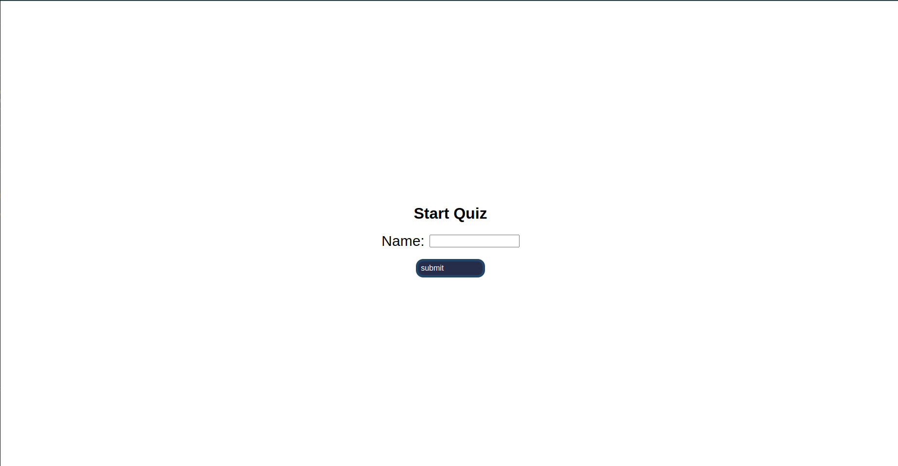
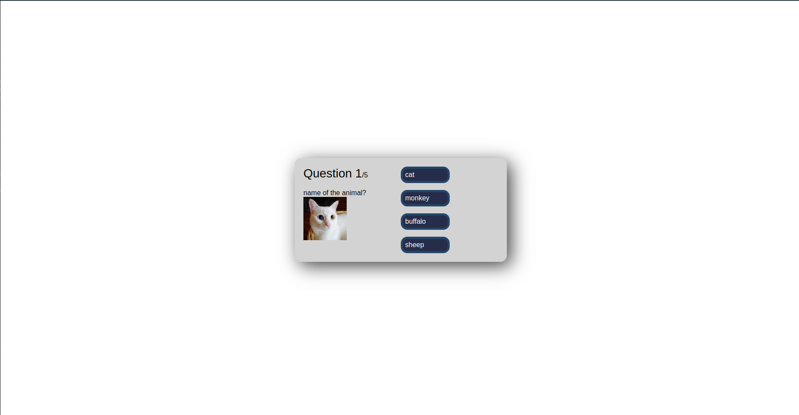
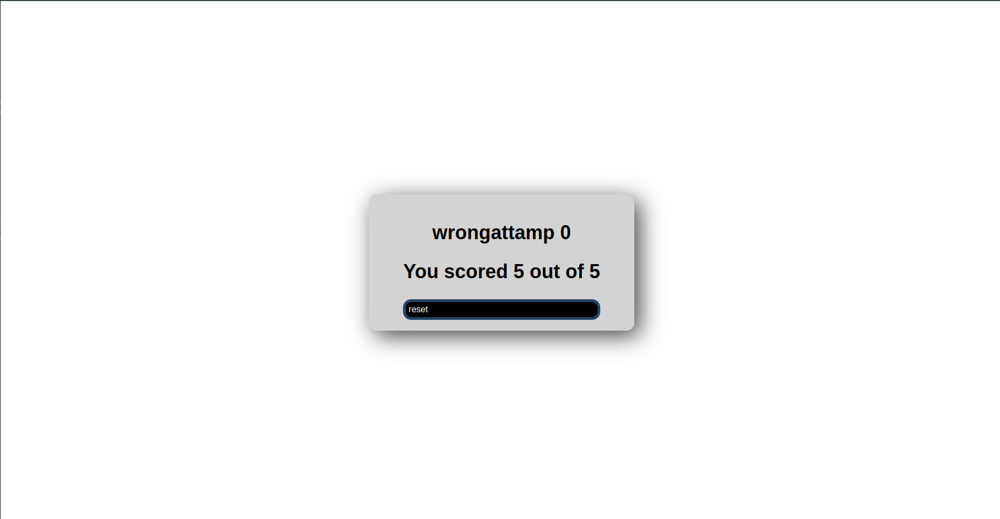

# Quiz App
This project is a simple Quiz application built using ReactJS. It allows users to input the name and start the Quiz with those five questions randomly we have to answer them and the we see the wrong attempt and the total correct..

## Getting Started
  Ensure you have the following installed on your development machine:

  Node.js
  npm (Node Package Manager)

### Installation

1. Clone the repository:
        `git clone https://github.com/Gautam9958/quiz.git`
    
2. Navigate into the project directory:
        `cd Quiz`

3. Install the required dependencies:
        `npm install`

## Available Scripts

In the project directory, you can run:
1. Start the development server:
        `npm start`
 

### `Project Structure`

Quiz/
├── node_modules/
├── public/
│   ├── index.html
│   ├── ...
├── src/
    ├──action/
        ├──index.js
    ├──quiz/
        ├──MainView.js
        ├──quiz.css
        ├──Quiz.js
        ├──QuizView.js
    ├──reducer/
        ├──index.js
        ├──UpDown.js
    ├── App.js
    ├── index.js
    ├── weather.css
├── .gitignore
├── package.json
├── README.md
└── ...

### `Data Store`
    We use a json data in which we store the questions of the quiz `QuizView.js`

### `Screenshots`
    To add screenshots, follow the structure below:

